# Software Requirements Specification (SRS) - zapota

## 1. Introduction

### 1.1 Purpose
This document provides the comprehensive technical specification and architectural overview for the multi-slice C application demonstration suite built and cross-compiled using native Zig (`build.zig` and `zig cc`).

### 1.2 Scope
The suite contains 26 distinct demo applications covering scripting, parsing, entity-component systems, 2D physics, vector graphics, GUI, networking, databases, TUI, multimedia codecs, machine learning tensors, and audio plugins:

1. **Hello World**: Basic C compilation & platform preprocessor diagnostics (`src/main.c`).
2. **Lua 5.4**: Embedded Lua script engine evaluation (`src/demo_lua.c`).
3. **cmark**: CommonMark Markdown parsing into abstract syntax tree (`src/demo_cmark.c`).
4. **libyaml**: YAML event stream parsing and tokenization (`src/demo_yaml.c`).
5. **Flecs**: Fast Entity Component System entities, components, and query iteration (`src/demo_flecs.c`).
6. **Box2D**: 2D rigid body physics world simulation with step updates (`src/demo_box2d.c`).
7. **PlutoVG**: Headless anti-aliased 2D vector graphics rasterization (`src/demo_plutovg.c`).
8. **Nuklear**: Immediate-mode GUI widget context simulation (`src/demo_nuklear.c`).
9. **H2O HTTP Server**: High-performance HTTP server using H2O's `picohttpparser` serving JSON API endpoints (`src/http_server.c`).
10. **SQLite Database**: Embedded relational SQL engine executing schema initialization, parameterized statements, and reports (`src/sqlite_demo.c`).
11. **PDCurses TUI**: Terminal User Interface with color window buffering and interactive keyboard input (`src/curses_demo.c`).
12. **Raylib Graphics**: Hardware-accelerated OpenGL / Win32 2D graphical rendering loop with physics animation (`src/raylib_demo.c`).
13. **x264 Video Encoder**: High-performance H.264 / AVC video encoding pipeline simulation (`src/demo_x264.c`).
14. **Opus Audio Codec**: Low-latency speech and audio codec encoding/decoding 48kHz audio frames (`src/demo_opus.c`).
15. **LAME MP3 Encoder**: MPEG Audio Layer III CBR/VBR audio encoding (`src/demo_lame.c`).
16. **Duktape JavaScript Engine**: Embedded ES5/ES6 ECMAScript interpreter evaluation (`src/demo_duktape.c`).
17. **GGML Tensor Computation**: Machine learning tensor computation graph engine (`src/demo_ggml.c`).
18. **JSON-C Parser & Serializer**: RFC 8259 JSON parsing, object manipulation, and serialization (`src/demo_json_c.c`).
19. **Libsixel Terminal Graphics**: High-quality 256-color image quantization to terminal Sixel stream (`src/demo_sixel.c`).
20. **NanoVG Vector Graphics**: Hardware/headless anti-aliased 2D vector drawing pipeline (`src/demo_nanovg.c`).
21. **CLAP Audio Plugin + NanoVG UI**: CLAP (CLever Audio Plugin) standard 1-pole lowpass filter with embedded headless NanoVG UI (`src/demo_clap.c`).
22. **Sokol**: Header-only time measurement and logging (`src/demo_sokol.c`).
23. **hiredis**: Redis RESP client command formatting (`src/demo_hiredis.c`).
24. **protobuf-c**: Protocol Buffers C runtime (`src/demo_protobuf_c.c`).
25. **wslay**: RFC 6455 WebSocket frame encode/decode (`src/demo_wslay.c`).
26. **Boehm GC**: Conservative garbage collector (`src/demo_gc.c`). Linked into every demo via `src/gc_init.c` unless `-Dgc=false`.

---

## 2. System Architecture

```mermaid
graph TD
    subgraph Official Upstream Sources in vendor/
        V1[vendor/lua]
        V2[vendor/cmark]
        V3[vendor/libyaml]
        V4[vendor/flecs]
        V5[vendor/box2d]
        V6[vendor/plutovg]
        V7[vendor/nuklear]
        V8[vendor/h2o]
        V9[vendor/sqlite]
        V10[vendor/pdcurses]
        V11[vendor/raylib]
        V12[vendor/x264]
        V13[vendor/opus]
        V14[vendor/libmp3lame]
        V15[vendor/duktape-amal]
        V16[vendor/ggml]
        V17[vendor/json-c]
        V18[vendor/libsixel]
        V19[vendor/nanovg]
        V20[vendor/clap]
    end

    subgraph Application Sources in src/
        S[24 C Demo Source Implementations]
    end

    subgraph Native Zig Build Orchestrator
        B[build.zig - Pure Zig Multi-Target Build Graph]
    end

    subgraph Generated Multi-Platform Binaries in zig-out/bin/
        B --> W[Windows: x86_64, aarch64]
        B --> L[Linux: x86_64, aarch64 musl]
        B --> M[macOS: x86_64, aarch64]
    end

    S --> B
    V1 --> B
    V2 --> B
    V3 --> B
    V4 --> B
    V5 --> B
    V6 --> B
    V7 --> B
    V8 --> B
    V9 --> B
    V10 --> B
    V11 --> B
    V12 --> B
    V13 --> B
    V14 --> B
    V15 --> B
    V16 --> B
    V17 --> B
    V18 --> B
    V19 --> B
    V20 --> B
```

---

## 3. Vendor Upstream Repositories

| Component | Upstream Repository | Vendor Directory |
| :--- | :--- | :--- |
| **Lua** | `https://github.com/lua/lua.git` | `vendor/lua` |
| **cmark** | `https://github.com/commonmark/cmark.git` | `vendor/cmark` |
| **libyaml** | `https://github.com/yaml/libyaml.git` | `vendor/libyaml` |
| **Flecs** | `https://github.com/SanderMertens/flecs.git` | `vendor/flecs` |
| **Box2D** | `https://github.com/erincatto/box2d.git` | `vendor/box2d` |
| **PlutoVG** | `https://github.com/sammycage/plutovg.git` | `vendor/plutovg` |
| **Nuklear** | `https://github.com/Immediate-Mode-UI/Nuklear.git` | `vendor/nuklear` |
| **H2O** | `https://github.com/h2o/h2o.git` | `vendor/h2o` |
| **SQLite** | `https://github.com/azadkuh/sqlite-amalgamation.git` | `vendor/sqlite` |
| **PDCurses** | `https://github.com/wmcbrine/PDCurses.git` | `vendor/pdcurses` |
| **Raylib** | `https://github.com/raysan5/raylib.git` | `vendor/raylib` |
| **x264** | `https://code.videolan.org/videolan/x264.git` | `vendor/x264` |
| **Opus** | `https://gitlab.xiph.org/xiph/opus.git` | `vendor/opus` |
| **LAME** | `https://github.com/Distrotech/lame.git` | `vendor/libmp3lame` |
| **Duktape** | `https://github.com/svaarala/duktape.git` | `vendor/duktape-amal` |
| **GGML** | `https://github.com/ggerganov/ggml.git` | `vendor/ggml` |
| **JSON-C** | `https://github.com/json-c/json-c.git` | `vendor/json-c` |
| **libsixel** | `https://github.com/libsixel/libsixel.git` | `vendor/libsixel` |
| **NanoVG** | `https://github.com/memononen/nanovg.git` | `vendor/nanovg` |
| **CLAP** | `https://github.com/free-audio/clap.git` | `vendor/clap` |
| **Sokol** | `https://github.com/floooh/sokol.git` | `vendor/sokol` |
| **hiredis** | `https://github.com/redis/hiredis.git` | `vendor/hiredis` |
| **protobuf-c** | `https://github.com/protobuf-c/protobuf-c.git` | `vendor/protobuf-c` |
| **wslay** | `https://github.com/tatsuhiro-t/wslay.git` | `vendor/wslay` |
| **Boehm GC** | `https://github.com/ivmai/bdwgc.git` | `vendor/bdwgc` |

---

## 4. Host Run Steps

All demo targets can be executed on the host system via `zig build <step>`:

| Target Step | Description | Source File |
| :--- | :--- | :--- |
| `run` | Platform preprocessor diagnostics | `src/main.c` |
| `run-lua` | Embedded Lua 5.4 interpreter | `src/demo_lua.c` |
| `run-cmark` | CommonMark markdown parsing | `src/demo_cmark.c` |
| `run-yaml` | LibYAML stream parser | `src/demo_yaml.c` |
| `run-flecs` | Flecs ECS entity & system iterations | `src/demo_flecs.c` |
| `run-box2d` | Box2D 2D physics simulation | `src/demo_box2d.c` |
| `run-plutovg` | PlutoVG vector graphics rendering | `src/demo_plutovg.c` |
| `run-nuklear` | Nuklear immediate-mode GUI | `src/demo_nuklear.c` |
| `run-http` | H2O HTTP server on port 8080 | `src/http_server.c` |
| `run-sqlite` | Embedded SQLite database operations | `src/sqlite_demo.c` |
| `run-curses` | PDCurses interactive terminal dashboard | `src/curses_demo.c` |
| `run-raylib` | Hardware-accelerated Raylib 2D scene | `src/raylib_demo.c` |
| `run-x264` | x264 H.264 encoder demo | `src/demo_x264.c` |
| `run-opus` | Opus 48kHz audio codec encode/decode | `src/demo_opus.c` |
| `run-lame` | LAME MP3 audio encoding demo | `src/demo_lame.c` |
| `run-duktape` | Duktape ECMAScript JavaScript engine | `src/demo_duktape.c` |
| `run-ggml` | GGML tensor computation graph | `src/demo_ggml.c` |
| `run-json-c` | JSON-C RFC 8259 parser & serializer | `src/demo_json_c.c` |
| `run-sixel` | Libsixel terminal graphics encoder | `src/demo_sixel.c` |
| `run-nanovg` | NanoVG headless vector graphics | `src/demo_nanovg.c` |
| `run-clap` | CLAP filter plugin with NanoVG UI | `src/demo_clap.c` |
| `run-sokol` | Sokol time and log headers | `src/demo_sokol.c` |
| `run-hiredis` | hiredis Redis client | `src/demo_hiredis.c` |
| `run-protobuf-c` | protobuf-c runtime | `src/demo_protobuf_c.c` |
| `run-wslay` | wslay WebSocket frames | `src/demo_wslay.c` |
| `run-gc` | Boehm garbage collector | `src/demo_gc.c` |

---

## 5. Cross-Compilation Matrix (`zig build all`)

`zig build all` cross-compiles demos into `zig-out/bin/` for:

1. `x86_64-windows-gnu` / `aarch64-windows-gnu`
2. `x86_64-linux-musl` / `aarch64-linux-musl`
3. `x86_64-macos` / `aarch64-macos`
4. `wasm32-wasi` (`zig build wasm`) — skips Lua, Duktape, SQLite, HTTP, hiredis, PDCurses, Raylib, PlutoVG, Flecs, Sokol, Boehm GC
5. `aarch64-linux-android.24` (`zig build android`) when an NDK is found

iOS (`aarch64-ios`) is not part of `zig build all` unless an iPhoneOS SDK is present (Xcode). Zig does not bundle iOS libc.

---

## 6. Vendor refresh

`zig build vendor-update` clones or fast-forwards every package in `VENDOR.md` from its upstream git remote. `git` must be available on `PATH`. See `tools/update_vendor.zig`.
